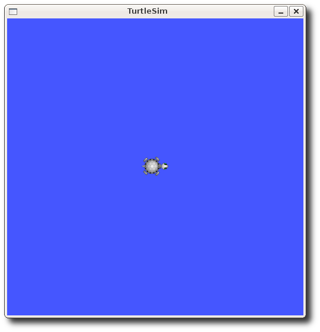

## 先决条件
在本教程中我们将使用到一个轻量级的模拟器，请使用以下命令来安装：
```sh
$ sudo apt-get install ros-<distro>-ros-tutorials
```
用你使用的ROS发行版本名称(例如`electric、fuerte、groovy、hydro`等)替换掉'`<distro>`'。

###图概念概述
+ `Nodes`:节点,一个节点即为一个可执行文件，它可以通过ROS与其它节点进行通信。

+ `Messages`:消息，消息是一种ROS数据类型，用于订阅或发布到一个话题。

+ `Topics`:话题,节点可以发布消息到话题，也可以订阅话题以接收消息。

+ `Master`:节点管理器，ROS名称服务 (比如帮助节点找到彼此)。

+ `rosout`: ROS中相当于`stdout/stderr`。

+ `roscore`: 主机+ rosout + 参数服务器 (参数服务器会在后面介绍)。

###节点
**一个节点其实只不过是ROS程序包中的一个可执行文件**。***ROS节点可以使用ROS客户库与其他节点通信。节点可以发布或接收一个话题。节点也可以提供或使用某种服务***。

（节点是ros中非常重要的一个概念，为了帮助初学者理解这个概念，这里举一个通俗的例子：

例如，咱们有一个机器人，和一个遥控器，那么这个机器人和遥控器开始工作后，就是两个节点。遥控器起到了下达指 令的作用；机器人负责监听遥控器下达的指令，完成相应动作。从这里我们可以看出，节点是一个能执行特定工作任 务的工作单元，并且能够相互通信，从而实现一个机器人系统整体的功能。在这里我们把遥控器和机器人简单定义为两个节点，实际上在机器人中根据控制器、传感器、执行机构等不同组成模块，还可以将其进一步细分为更多的节点，这个是根据用户编写的程序来定义的。）

###客户端库
ROS客户端库允许使用不同编程语言编写的节点之间互相通信:

+ `rospy` = python 客户端库
+ `roscpp` = c++ 客户端库
###`roscore`
roscore 是你在运行所有ROS程序前首先要运行的命令。

请运行:
```sh
$ roscore
```
然后你会看到类似下面的输出信息:
```sh
... logging to ~/.ros/log/9cf88ce4-b14d-11df-8a75-00251148e8cf/roslaunch-

machine_name-13039.log
Checking log directory for disk usage. This may take awhile.
Press Ctrl-C to interrupt
Done checking log file disk usage. Usage is <1GB.

started roslaunch server http://machine_name:33919/
ros_comm version 1.4.7

SUMMARY
========

PARAMETERS
 * /rosversion
 * /rosdistro

NODES

auto-starting new master
process[master]: started with pid [13054]
ROS_MASTER_URI=http://machine_name:11311/

setting /run_id to 9cf88ce4-b14d-11df-8a75-00251148e8cf
process[rosout-1]: started with pid [13067]
started core service [/rosout]
```
如果 `roscore` 运行后无法正常初始化，很有可能是存在网络配置问题。参见

###网络设置——单机设置

如果 roscore 不能初始化并提示缺少权限，这可能是因为~/.ros文件夹

归属于root用户（只有root用户才能访问），修改该文件夹的用户归属关系：

```sh
$ sudo chown -R <your_username> ~/.ros
```
### 使用rosnode
打开一个新的终端, 可以使用 `rosnode` 像运行 `roscore` 一样看看在

运行什么...


>注意: 当打开一个新的终端时，你的运行环境会复位，同时你的`~/.bashrc`文件会复原。如果你在运行类似于rosnode的指令时出现一些问题，也许你需要添加一些环境设置文件到你的`~/.bashrc`或者手动重新配置他们。

`rosnode` 显示当前运行的ROS节点信息。`rosnode list` 指令列出活跃的节点:

```sh
$ rosnode list
```
你会看到:
```sh
/rosout
```
这表示当前只有一个节点在运行: `rosout`。因为这个节点**用于收集和记录节点调试输出信息，所以它总是在运行的**。

`rosnode info` 命令返回的是关于一个特定节点的信息。

```sh
$ rosnode info /rosout
```
这给了我们更多的一些有关于rosout的信息, 例如，事实上由它发布
```sh
/rosout_agg.

------------------------------------------------------------------------
Node [/rosout]
Publications:
 * /rosout_agg [rosgraph_msgs/Log]

Subscriptions:
 * /rosout [unknown type]

Services:
 * /rosout/set_logger_level
 * /rosout/get_loggers

contacting node http://machine_name:54614/ ...
Pid: 5092
```
现在，让我们看看更多的节点。为此，我们将使用rosrun 弹出另一个节点。

###使用 rosrun
`rosrun` 允许你使用包名直接运行一个包内的节点(而不需要知道这个包的路径)。

用法:

```sh
$ rosrun [package_name] [node_name]
```
现在我们可以运行`turtlesim`包中的 `turtlesim_node`。

然后, 在一个 新的终端:

```sh
$ rosrun turtlesim turtlesim_node
```
你会看到 `turtlesim` 窗口:



>**注意**: 这里的 turtle 可能和你的 turtlesim 窗口不同。别担心，这里有许多版本的turtle ，而你的是一个惊喜!（一个可爱的小彩蛋～）

在一个 新的终端:

```sh
$ rosnode list
```
你会看见类似于:
```sh
/rosout
/turtlesim
```
ROS的一个强大特性就是你可以通过命令行重新配置名称。

关闭 turtlesim 窗口停止运行节点 (或者回到`rosrun turtlesim`终端并使用`ctrl-C`)。现在让我们重新运行它，但是这一次使用`Remapping Argument`改变节点名称:

```sh
$ rosrun turtlesim turtlesim_node __name:=my_turtle
```
现在，我们退回使用 `rosnode list`:

```sh
$ rosnode list
```
你会看见类似于:
```sh
/rosout
/my_turtle
```
>**注意**: 如果你仍看到 /turtlesim在列表中，这可能意味着你在终端中使用`ctrl-C`停止节点而不是关闭窗口，或者你没有`$ROS_HOSTNAME`环境变量，这在`Network Setup - Single Machine Configuration`中有定义。你可以尝试清除`rosnode`列表，通过: **`$ rosnode cleanup`**

我们可以看到新的`/my_turtle` 节点。使用另外一个 `rosnode` 指令, `ping`, 来

测试:

```sh
$ rosnode ping my_turtle
rosnode: node is [/my_turtle]
pinging /my_turtle with a timeout of 3.0s
xmlrpc reply from http://aqy:42235/     time=1.152992ms
xmlrpc reply from http://aqy:42235/     time=1.120090ms
xmlrpc reply from http://aqy:42235/     time=1.700878ms
xmlrpc reply from http://aqy:42235/     time=1.127958ms
```
##回顾
本节所涉及的内容:

+ `roscore = ros+core : master (provides name service for ROS) + rosout`

(stdout/stderr) + parameter server (parameter server will be introduced later)

+ `rosnode = ros+node : ROS tool to get information about a node.`
+ `rosrun = ros+run : runs a node from a given package.`

到这里，您已经了解了ROS节点是如何工作的，下一步，我们来了解一下

ROS话题。如果您想关闭

`turtlesim_node`，请按下“`Ctrl-C`”