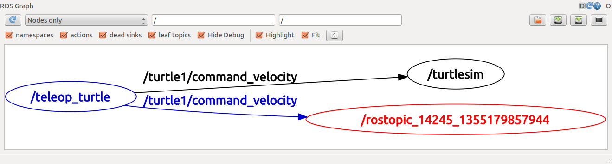
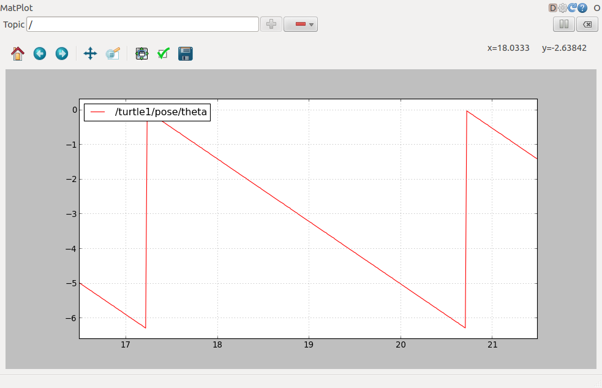

## 开始
##### roscore
首先确保`roscore`已经运行, 打开一个新的终端：

```sh
$ roscore
```
如果你没有退出在上一篇教程中运行的`roscore`，那么你可能会看到下面的错误信息：
```sh
roscore cannot run as another roscore/master is already running.
Please kill other roscore/master processes before relaunching
```
这是正常的，因为只需要有一个`roscore`在运行就够了。

##### turtlesim
在本教程中我们也会使用到`turtlesim`，请在一个新的终端中运行：

```sh
$ rosrun turtlesim turtlesim_node
```
#####通过键盘远程控制turtle
我们也需要通过键盘来控制turtle的运动，请在一个新的终端中运行：

```sh
$ rosrun turtlesim turtle_teleop_key
[ INFO] 1254264546.878445000: Started node [/teleop_turtle], pid [5528], bound on [aqy], xmlrpc port [43918], tcpros port [55936], logging to [~/ros/ros/log/teleop_turtle_5528.log], using [real] time
Reading from keyboard
---------------------------
Use arrow keys to move the turtle.
```
现在你可以使用键盘上的方向键来控制turtle运动了。如果不能控制，请选中turtle_teleop_key所在的终端窗口以确保你的按键输入能够被捕获。


现在你可以控制turtle运动了，下面我们一起来看看这背后发生的事。

##ROS Topics
`turtlesim_node`节点和`turtle_teleop_key`节点之间是通过一个ROS话题来互相通信的。`turtle_teleop_key`在一个话题上发布按键输入消息，而`turtlesim`则订阅该话题以接收该消息。下面让我们使用`rqt_graph`来显示当前运行的节点和话题。

>注意：如果你使用的是electric或更早期的版本，那么rqt是不可用的，请使用rxgraph代替。

#####使用 rqt_graph
`rqt_graph`能够创建一个显示当前系统运行情况的动态图形。`rqt_graph`是rqt程序包中的一部分。如果你没有安装，请通过以下命令来安装：
```sh
$ sudo apt-get install ros-<distro>-rqt
$ sudo apt-get install ros-<distro>-rqt-common-plugins
```
请使用你的ROS版本名称（比如`fuerte、groovy、hydro`等）来替换掉`<distro>`。

在一个新终端中运行:

```sh
$ rosrun rqt_graph rqt_graph
```
你会看到类似下图所示的图形：


如果你将鼠标放在`/turtle1/command_velocity`上方，相应的ROS节点（蓝色和绿色）和话题（红色）就会高亮显示。正如你所看到的，`turtlesim_node`和`turtle_teleop_key`节点正通过一个名为 `/turtle1/command_velocity`的话题来互相通信。


#####rostopic介绍
`rostopic`命令工具能让你获取有关ROS话题的信息。

你可以使用帮助选项查看`rostopic`的子命令：

```sh
$ rostopic -h
rostopic bw     display bandwidth used by topic
rostopic echo   print messages to screen
rostopic hz     display publishing rate of topic
rostopic list   print information about active topics
rostopic pub    publish data to topic
rostopic type   print topic type
```
接下来我们将使用其中的一些子命令来查看`turtlesim`。

#####使用 `rostopic echo`
`rostopic echo`可以显示在某个话题上发布的数据。

用法：

```sh
rostopic echo [topic]
```
让我们在一个新终端中看一下`turtle_teleop_key`节点在`/turtle1/command_velocity`话题（非hydro版）上发布的数据。

```sh
$ rostopic echo /turtle1/command_velocity
```
如果你是用`ROS Hydro` 及其之后的版本（下同），请运行：

```sh
$ rostopic echo /turtle1/cmd_vel
```
你可能看不到任何东西因为现在还没有数据发布到该话题上。接下来我们通过按下方向键使`turtle_teleop_key`节点发布数据。记住如果`turtle`没有动起来的话就需要你重新选中`turtle_teleop_key`节点运行时所在的终端窗口。

现在当你按下向上方向键时应该会看到下面的信息：
```sh
---
linear: 2.0
angular: 0.0
---
linear: 2.0
angular: 0.0
---
linear: 2.0
angular: 0.0
---
linear: 2.0
angular: 0.0
---
linear: 2.0
angular: 0.0
```
或者在hrydro中如下：

```sh
linear:
  x: 2.0
  y: 0.0
  z: 0.0
angular:
  x: 0.0
  y: 0.0
  z: 0.0
---
linear:
  x: 2.0
  y: 0.0
  z: 0.0
angular:
  x: 0.0
  y: 0.0
  z: 0.0
---
```
现在让我们再看一下`rqt_graph`（你可能需要刷新一下`ROS graph`）。正如你所看到的，`rostopic echo`(红色显示部分）现在也订阅了`turtle1/command_velocity`话题。



#####使用 rostopic list
`rostopic list`能够列出所有当前订阅和发布的话题。

让我们查看一下list子命令需要的参数，在一个新终端中运行：

```sh
$ rostopic list -h
Usage: rostopic list [/topic]

Options:
  -h, --help            show this help message and exit
  -b BAGFILE, --bag=BAGFILE
                        list topics in .bag file
  -v, --verbose         list full details about each topic
  -p                    list only publishers
  -s                    list only subscribers
```
在`rostopic list`中使用`verbose`选项：

```sh
$ rostopic list -v
```
这会显示出有关所发布和订阅的话题及其类型的详细信息。
```sh
Published topics:
 * /turtle1/color_sensor [turtlesim/Color] 1 publisher
 * /turtle1/command_velocity [turtlesim/Velocity] 1 publisher
 * /rosout [roslib/Log] 2 publishers
 * /rosout_agg [roslib/Log] 1 publisher
 * /turtle1/pose [turtlesim/Pose] 1 publisher

Subscribed topics:
 * /turtle1/command_velocity [turtlesim/Velocity] 1 subscriber
 * /rosout [roslib/Log] 1 subscriber
```
##ROS Messages
话题之间的通信是通过在节点之间发送ROS消息实现的。对于发布器(`turtle_teleop_key`)和订阅器(`turtulesim_node`)之间的通信，发布器和订阅器之间必须发送和接收相同类型的消息。这意味着话题的类型是由发布在它上面的消息类型决定的。使用rostopic type命令可以查看发布在某个话题上的消息类型。

#####使用 `rostopic type`
`rostopic type `命令用来查看所发布话题的消息类型。

用法：

```sh
rostopic type [topic]
```
运行(非hydro版)：

```sh
$ rostopic type /turtle1/command_velocity
```
你应该会看到:
```sh
turtlesim/Velocity
```
hydro版请运行：

```sh
$ rostopic type /turtle1/cmd_vel
```
你应该会看到:
```sh
geometry_msgs/Twist
```
我们可以使用`rosmsg`命令来查看消息的详细情况（非hydro版)：

```sh
$ rosmsg show turtlesim/Velocity
float32 linear
float32 angular
```
hydro版：

```sh
$ rosmsg show geometry_msgs/Twist
geometry_msgs/Vector3 linear
  float64 x
  float64 y
  float64 z
geometry_msgs/Vector3 angular
  float64 x
  float64 y
  float64 z
```
现在我们已经知道了`turtlesim`节点所期望的消息类型，接下来我们就可以给turtle发布命令了。

##继续学习 rostopic
现在我们已经了解了什么是ROS的消息，接下来我们开始结合消息来使用rostopic。

#####使用 rostopic pub
rostopic pub可以把数据发布到当前某个正在广播的话题上。

用法：

```sh
rostopic pub [topic] [msg_type] [args]
```
示例（非hydro版）：

```sh
$ rostopic pub -1 /turtle1/command_velocity turtlesim/Velocity  -- 2.0  1.8
```
示例（hydro版)：

```sh
$ rostopic pub -1 /turtle1/cmd_vel geometry_msgs/Twist -- '[2.0, 0.0, 0.0]' '[0.0, 0.0, 1.8]'
```
以上命令会发送一条消息给turtlesim，告诉它以2.0大小的线速度和1.8大小的角速度开始移动。

.png)

这是一个非常复杂的例子，因此让我们来详细分析一下其中的每一个参数。
```sh
rostopic pub
```
这条命令将会发布消息到某个给定的话题。
```sh
 -1
```
（单个破折号）这个参数选项使rostopic发布一条消息后马上退出。
```sh
/turtle1/command_velocity
```
这是消息所发布到的话题名称。
```sh
turtlesim/Velocity
```
这是所发布消息的类型。
```sh
--
```
（双破折号）这会告诉命令选项解析器接下来的参数部分都不是命令选项。这在参数里面包含有破折号-（比如负号）时是必须要添加的。
```sh
2.0 1.8
```
正如之前提到的，在一个`turtlesim/Velocity`消息里面包含有两个浮点型元素：`linear`和`angular`。在本例中，2.0是linear的值，1.8是angular的值。这些参数其实是按照YAML语法格式编写的，这在YAML文档中有更多的描述。

你可能已经注意到turtle已经停止移动了。这是因为turtle需要一个稳定的**频率**为1Hz的命令流来保持移动状态。我们可以使用`rostopic pub -r`命令来发布一个稳定的命令流（非hydro版）：

```sh
$ rostopic pub /turtle1/command_velocity turtlesim/Velocity -r 1 -- 2.0  -1.8
```
hydro版：

```sh
$ rostopic pub /turtle1/cmd_vel geometry_msgs/Twist -r 1 -- '[2.0, 0.0, 0.0]' '[0.0, 0.0, 1.8]'
```
这条命令以1Hz的频率发布速度命令到速度话题上。

2.png)

我们也可以看一下rqt_graph中的情形，可以看到rostopic发布器节点（红色）正在与rostopic echo节点（绿色）进行通信：


正如你所看到的，turtle正沿着一个圆形轨迹连续运动。我们可以在一个新终端中通过`rostopic echo`命令来查看turtlesim所发布的数据。

#####使用 rostopic hz
`rostopic hz`命令可以用来查看数据发布的频率。

用法：

```sh
rostopic hz [topic]
```
我们看一下`turtlesim_node`发布`/turtle/pose`时有多快：

```sh
$ rostopic hz /turtle1/pose
```
你会看到：
```sh
subscribed to [/turtle1/pose]
average rate: 59.354
        min: 0.005s max: 0.027s std dev: 0.00284s window: 58
average rate: 59.459
        min: 0.005s max: 0.027s std dev: 0.00271s window: 118
average rate: 59.539
        min: 0.004s max: 0.030s std dev: 0.00339s window: 177
average rate: 59.492
        min: 0.004s max: 0.030s std dev: 0.00380s window: 237
average rate: 59.463
        min: 0.004s max: 0.030s std dev: 0.00380s window: 290
```
现在我们可以知道了`turtlesim`正以大约60Hz的频率发布数据给turtle。我们也可以结合`rostopic type`和`rosmsg show`命令来获取关于某个话题的更深层次的信息（非hydro版）：

```sh
$ rostopic type /turtle1/command_velocity | rosmsg show
```
hydro版：

```sh
rostopic type /turtle1/cmd_vel | rosmsg show
```
到此我们已经完成了通过rostopic来查看话题相关情况的过程，接下来我将使用另一个工具来查看turtlesim发布的数据。

#####使用 rqt_plot
注意：如果你使用的是electric或更早期的ROS版本，那么rqt命令是不可用的，请使用rxplot命令来代替。

rqt_plot命令可以实时显示一个发布到某个话题上的数据变化图形。这里我们将使用rqt_plot命令来绘制正在发布到/turtle1/pose话题上的数据变化图形。首先，在一个新终端中运行rqt_plot命令：

```sh
$ rosrun rqt_plot rqt_plot
```
这会弹出一个新窗口，在窗口左上角的一个文本框里面你可以添加需要绘制的话题。在里面输入`/turtle1/pose/x`后之前处于禁用状态的加号按钮将会被使能变亮。按一下该按钮，并对`/turtle1/pose/y`重复相同的过程。现在你会在图形中看到turtle的x-y位置坐标图。


按下减号按钮会显示一组菜单让你隐藏图形中指定的话题。现在隐藏掉你刚才添加的话题并添加/turtle1/pose/theta，你会看到如下图所示的图形：



本部分教程到此为止，请使用`Ctrl-C`退出rostopic命令，但要保持turtlesim继续运行。

