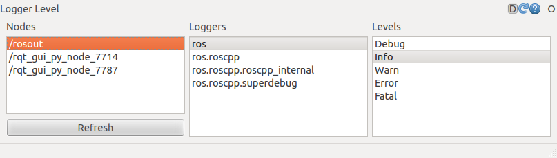
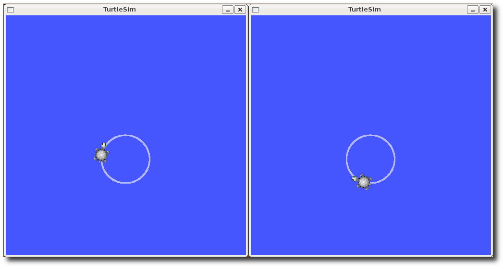
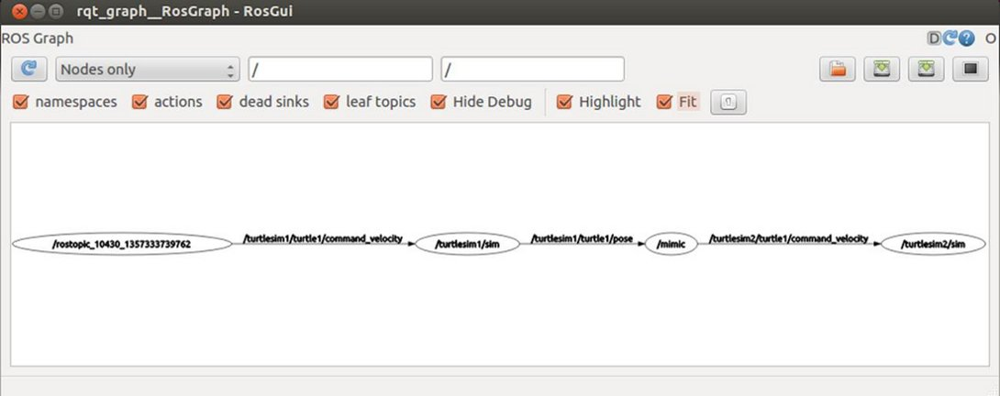

##预先安装rqt和turtlesim程序包
本教程会用到`rqt` 和 `turtlesim`这两个程序包，如果你没有安装，请先安装：

```sh
$ sudo apt-get install ros-<distro>-rqt ros-<distro>-rqt-common-plugins ros-<distro>-turtlesim
```
请使用ROS发行版名称(比如 `electric、fuerte、groovy、hydro`或最新的`indigo`)替换掉`<distro>`。

> 注意： 你可能已经在之前的某篇教程中编译过rqt和turtlesim，如果你不确定的话重新编译一次也没事。

##使用`rqt_console`和`rqt_logger_level`
`rqt_console`属于ROS日志框架(`logging framework`)的一部分，用来显示节点的输出信息。`rqt_logger_level`允许我们修改节点运行时输出信息的日志等级（`logger levels`）（包括 `DEBUG、WARN、INFO和ERROR`）。

现在让我们来看一下`turtlesim`在`rqt_console`中的输出信息，同时在`rqt_logger_level`中修改日志等级。在启动`turtlesim`之前先在另外两个新终端中运行`rqt_console`和`rqt_logger_level`：

```sh
$ rosrun rqt_console rqt_console

$ rosrun rqt_logger_level rqt_logger_level
```
你会看到弹出两个窗口：


.png)



现在让我们在一个新终端中启动`turtlesim`：

```sh
$ rosrun turtlesim turtlesim_node
```
因为默认日志等级是INFO，所以你会看到turtlesim启动后输出的所有信息，如下图所示：


.png)

现在让我们刷新一下`rqt_logger_level`窗口并选择Warn将日志等级修改为WARN，如下图所示：


.png)

现在我们让turtle动起来并观察rqt_console中的输出（非hydro版）：

```sh
rostopic pub /turtle1/command_velocity turtlesim/Velocity -r 1 -- 2.0  0.0
```
hydro版：

```sh
rostopic pub /turtle1/cmd_vel geometry_msgs/Twist -r 1 -- '[2.0, 0.0, 0.0]' '[0.0, 0.0, 0.0]'
```

.png)

#####日志等级说明
日志等级按以下优先顺序排列：

```
Fatal
Error
Warn
Info
Debug
```
`Fatal`是最高优先级，`Debug`是最低优先级。通过设置日志等级你可以获取该等级及其以上优先等级的所有日志消息。比如，将日志等级设为`Warn`时，你会得到`Warn、Error`和`Fatal`这三个等级的所有日志消息。

现在让我们按`Ctrl-C`退出`turtlesim`节点，接下来我们将使用`roslaunch`来启动多个`turtlesim`节点和一个模仿节点以让一个`turtlesim`节点来模仿另一个`turtlesim`节点。

#####使用roslaunch
roslaunch可以用来启动定义在launch文件中的多个节点。

用法：

```sh
$ roslaunch [package] [filename.launch]
```
先切换到`beginner_tutorials`程序包目录下：

```sh
$ roscd beginner_tutorials
```
如果roscd执行失败了，记得设置你当前终端下的`ROS_PACKAGE_PATH`环境变量，设置方法如下：

```sh
$ export ROS_PACKAGE_PATH=~/<distro>_workspace/sandbox:$ROS_PACKAGE_PATH
$ roscd beginner_tutorials
```
如果你仍然无法找到`beginner_tutorials`程序包，说明该程序包还没有创建，那么请返回到`ROS/Tutorials/CreatingPackage`教程，并按照创建程序包的操作方法创建一个`beginner_tutorials`程序包。

然后创建一个launch文件夹：

```sh
$ mkdir launch
$ cd launch
```
#####Launch 文件

现在我们来创建一个名为`turtlemimic.launch`的`launch`文件并复制粘贴以下内容到该文件里面：
```xml


   1 <launch>
   2 
   3   <group ns="turtlesim1">
   4     <node pkg="turtlesim" name="sim" type="turtlesim_node"/>
   5   </group>
   6 
   7   <group ns="turtlesim2">
   8     <node pkg="turtlesim" name="sim" type="turtlesim_node"/>
   9   </group>
  10 
  11   <node pkg="turtlesim" name="mimic" type="mimic">
  12     <remap from="input" to="turtlesim1/turtle1"/>
  13     <remap from="output" to="turtlesim2/turtle1"/>
  14   </node>
  15 
  16 </launch>
```
#####Launch 文件解析
现在我们开始逐句解析`launch xml`文件。

```xml

   1 <launch>
```
在这里我们以launch标签开头以表明这是一个launch文件。

```xml

   3   <group ns="turtlesim1">
   4     <node pkg="turtlesim" name="sim" type="turtlesim_node"/>
   5   </group>
   6 
   7   <group ns="turtlesim2">
   8     <node pkg="turtlesim" name="sim" type="turtlesim_node"/>
   9   </group>
```
在这里我们创建了两个节点分组并以'命名空间（`namespace`)'标签来区分，其中一个名为`turtulesim1`，另一个名为`turtlesim2`，两个组里面都使用相同的`turtlesim`节点并命名为'`sim`'。这样可以让我们同时启动两个`turtlesim`模拟器而不会产生命名冲突。

```xml

  11   <node pkg="turtlesim" name="mimic" type="mimic">
  12     <remap from="input" to="turtlesim1/turtle1"/>
  13     <remap from="output" to="turtlesim2/turtle1"/>
  14   </node>
```
在这里我们启动模仿节点，并将所有话题的输入和输出分别重命名为`turtlesim1`和`turtlesim2`，这样就会使`turtlesim2`模仿`turtlesim1`。

```sh

  16 </launch>
```
这个是launch文件的结束标签。

#####roslaunching
现在让我们通过`roslaunch`命令来启动launch文件：

```sh
$ roslaunch beginner_tutorials turtlemimic.launch
```
现在将会有两个`turtlesims`被启动，然后我们在一个新终端中使用`rostopic`命令发送速度设定消息：

非hydro版：

```sh
$ rostopic pub /turtlesim1/turtle1/command_velocity turtlesim/Velocity -r 1 -- 2.0  -1.8
```
hydro版：

```sh
$ rostopic pub /turtlesim1/turtle1/cmd_vel geometry_msgs/Twist -r 1 -- '[2.0, 0.0, 0.0]' '[0.0, 0.0, -1.8]'
```
你会看到两个turtlesims会同时开始移动，虽然发布命令只是给turtlesim1发送了速度设定消息。




我们也可以通过`rqt_graph`来更好的理解在launch文件中所做的事情。运行rqt并在主窗口中选择`rqt_graph`：

```sh
$ rqt
```
或者直接运行：

```sh
$ rqt_graph
```


到此，我们算是已经学会了`rqt_console`和`roslaunch`命令的使用，接下来我们开始学习使用`rosed`——ROS中的编辑器。现在你可以按`Ctrl-C`退出所有`turtlesims`节点了，因为在下一篇教程中你不会再用到它们。