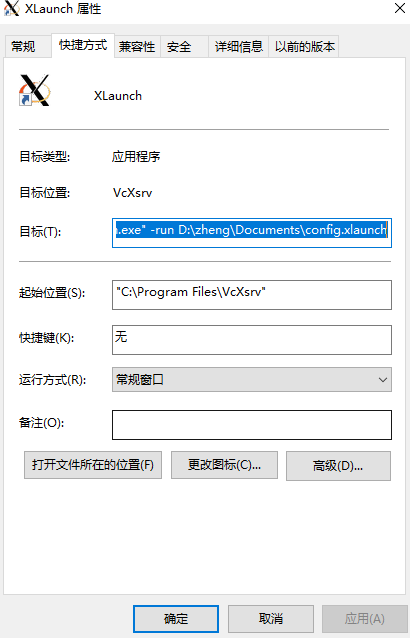
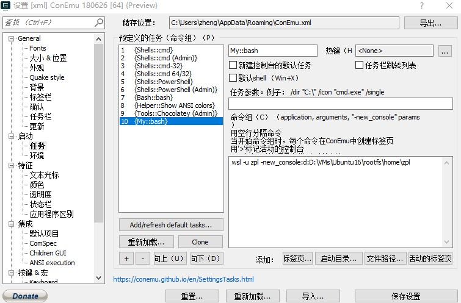
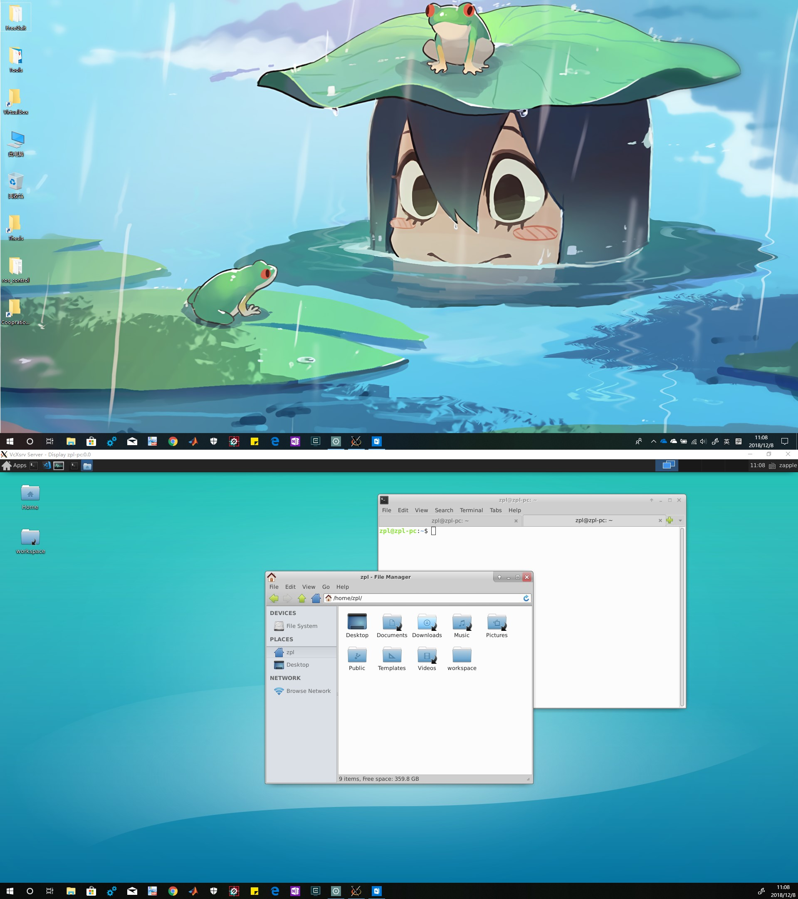

# 如何使用*Windows Linux Subsystem*

特别感谢以下项目,是这些项目的辛勤付出才有了如此好的方法：

1. [Windows Linux 子系统](https://docs.microsoft.com/en-us/windows/wsl/install-win10 "官方安装教程")
2. [LxRunOffline](https://github.com/DDoSolitary/LxRunOffline "替代官方安装的工具")
3. [VcxSrv](https://sourceforge.net/projects/vcxsrv/ "显示工具")
4. [ConEmu](https://conemu.github.io/ "牛逼的终端模拟")

## 安装基础系统
参照**LxRunOffline**官方[`wiki`](https://github.com/DDoSolitary/LxRunOffline/wiki)给出的方法,完成基础安装.

1. 从网站`https://lxrunoffline.apphb.com/download/{distro}/{version}`下载原始压缩包,其中`{distro}`代表`Linux`分发版本，可以是`Debian`、`Ubuntu`、`UbuntuFromMS`、`ArchLinux`、`Fedora`、`Alpine`$^3$、`openSUSE`中的任意一种;`{version}`代表版本。例如，想下载*Ubuntu 16.04 Lts*版本，对应的网址为：`https://lxrunoffline.apphb.com/download/Ubuntu/xenial`
2. 打开一个`Windows Powershell`终端，输入以下命令：
   ```ps
    cd '{Path\to\LxRunOffline}'
    .\LxRunOffline.exe i -n '{NameOfWSL}' -d '{InstallPath}' -f '{DownloadedFile}'
   ```
`LxRunOffline`的用法：

```
Supported actions are:
l, list            List all installed distributions.
gd, get-default    Get the default distribution, which is used bybash.exe.
sd, set-default    Set the default distribution, which is used bybash.exe.
i, install         Install a new distribution.
ui, uninstall      Uninstall a distribution.
rg, register       Register an existing installation directory.
ur, unregister     Unregister a distribution but not delete theinstallation directory.
m, move            Move a distribution to a new directory.
d, duplicate       Duplicate an existing distribution in a new directory.
e, export          Export a distribution's filesystem to a .tar.gz file,which can be imported by the "install" command.
r, run             Run a command in a distribution.
di, get-dir        Get the installation directory of a distribution.
gv, get-version    Get the filesystem version of a distribution.
ge, get-env        Get the default environment variables of adistribution.
se, set-env        Set the default environment variables of adistribution.
ae, add-env        Add to the default environment variables of adistribution.
re, remove-env     Remove from the default environment variables of adistribution.
gu, get-uid        Get the UID of the default user of a distribution.
su, set-uid        Set the UID of the default user of a distribution.
gk, get-kernelcmd  Get the default kernel command line of a distribution.
sk, set-kernelcmd  Set the default kernel command line of a distribution.
gf, get-flags      Get some flags of a distribution. Seehttps://docs.microsoftcom/en-us/previous-versions/windows/desktop/api/wslapi/ne-wslapi-wsl_distibution_flags for details.
sf, set-flags      Set some flags of a distribution. Seehttps://docs.microsoftcom/en-us/previous-versions/windows/desktop/api/wslapi/ne-wslapi-wsl_distibution_flags for details.
s, shortcut        Create a shortcut to launch a distribution.
ec, export-config  Export configuration of a distribution to an XML file.
ic, import-config  Import configuration of a distribution from an XMLfile.
version        Get version information about this LxRunOffline.exe.
```
## 安装VcxSrv
安装之后按照如下设置：
```
One Large window => Display number=0 => start no client => Clipboard\Primary Selection\Disable access control => Save configuration
```
然后为了以后使用的方便，在桌面建立一个快捷方式如下：



**! 注意** 启动时加入参数`-run XconfigFile`

## 安装ConEmu
安装后建立自己的一个终端启动方法如下:


## 最终效果


